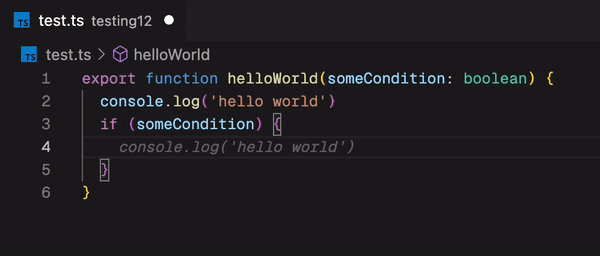
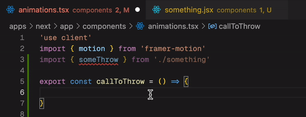

<p align="center">

</p>

<p align="center">
  
  
</p>

<!-- JetBrains Plugin description 1 -->
# What Does It Throw? (WDIT)

TLDR; This is a *blazingly* fast **LSP server** to find *throw statements* in your JavaScript/TypeScript code. It's written in Rust and based on [SWC](https://swc.rs/) 🔥. It works for most ECMAScript files, such as `.ts`, `.js`, `.tsx` and `.jsx`. 

<!-- JetBrains Plugin description end 1 -->

### Check it out in action:



Also supports **call expressions**:



## How It Works

What Does It Throw analyzes your JavaScript/TypeScript code using a fast Rust-based parser (SWC) to identify:

1. **Direct Throw Statements** - Functions that contain `throw` statements
2. **Call Expressions** - Function calls may throw based on the called function's behavior
3. **JSDoc Documentation** - Functions with `@throws` annotations for proper error documentation

The analysis provides real-time diagnostics in your editor, helping you:
- Understand which functions can throw errors
- Document error handling with JSDoc annotations
- Handle errors appropriately with try/catch blocks
- Maintain better control flow in your codebase

## JSDoc @throws Support

The latest version includes comprehensive support for JSDoc `@throws` annotations, enabling proper error documentation and validation.

### Basic Usage

Document what errors your functions throw:

```javascript
/**
 * Validates user input
 * @param {string} input - The input to validate
 * @throws {TypeError} When input is not a string
 * @throws {ValidationError} When input is empty or invalid
 */
function validateInput(input) {
  if (typeof input !== 'string') {
    throw new TypeError('Input must be a string');
  }
  if (!input.trim()) {
    throw new ValidationError('Input cannot be empty');
  }
  return input.trim();
}
```

### Supported Formats

The tool supports multiple JSDoc `@throws` annotation formats:

```javascript
// With curly braces (recommended)
/** @throws {Error} Description of when this error occurs */

// Multiple throws
/**
 * @throws {TypeError} When type is invalid
 * @throws {RangeError} When value is out of range
 * @throws {CustomError} When custom validation fails
 */

// Legacy format (comma-separated)
/** @throws Error, TypeError when something goes wrong */
```

### Error Coverage Analysis

The tool validates that your JSDoc documentation matches your actual throw statements:

```javascript
/**
 * @throws {TypeError} When input is invalid
 */
function example(input) {
  if (!input) throw new TypeError('Invalid input');  // ✅ Documented
  if (input.length > 100) throw new RangeError('Too long');  // ❌ Undocumented!
}
```

In this case, you'll get a diagnostic: `"JSDoc defines TypeError, but not RangeError"`

### Call Chain Documentation

When a documented function calls another documented function, the tool can suppress redundant diagnostics:

```javascript
/**
 * @throws {ValidationError} When validation fails
 */
function processData(data) {
  validateInput(data);  // No diagnostic if ValidationError is covered
  return data.toUpperCase();
}
```

## Exhaustive Catch Block Validation

The latest version includes **exhaustive-by-default catch block validation**, ensuring your error handling is complete and explicit.

### How It Works

**All catch blocks are validated to be exhaustive by default**. This means every catch block must:
1. Handle all possible error types with `instanceof` checks, OR
2. Use `throw e` as an explicit escape hatch for unhandled errors

### ✅ Complete Catch (Recommended)

Handle all possible error types explicitly:

```javascript
function processUser(data) {
  try {
    validateInput(data);        // throws ValidationError
    fetchFromAPI(data.id);      // throws NetworkError  
    saveToDatabase(data);       // throws DatabaseError
    return { success: true };
  } catch (e) {
    if (e instanceof ValidationError) {
      return { error: 'validation', message: e.message };
    } else if (e instanceof NetworkError) {
      return { error: 'network', message: 'Service unavailable' };
    } else if (e instanceof DatabaseError) {
      return { error: 'database', message: 'Storage failed' };
    }
    // ✅ All possible errors handled - exhaustive!
  }
}
```

### ✅ Escape Hatch Pattern

Use `throw e` to explicitly propagate unhandled errors:

```javascript
/**
 * @throws {DatabaseError} When storage fails
 * @throws {AuthenticationError} When auth fails  
 */
function processUserWithEscapeHatch(data) {
  try {
    validateInput(data);        // throws ValidationError
    fetchFromAPI(data.id);      // throws NetworkError
    authenticateUser(data);     // throws AuthenticationError
    saveToDatabase(data);       // throws DatabaseError
    return { success: true };
  } catch (e) {
    if (e instanceof ValidationError) {
      return { error: 'validation' };  // Handled
    } else if (e instanceof NetworkError) {
      return { error: 'network' };     // Handled
    }
    throw e; // ✅ Explicit escape hatch - remaining errors propagate
  }
}
```

### ❌ Incomplete Catch (Will Show Error)

Missing handlers without escape hatch:

```javascript
function processUserIncomplete(data) {
  try {
    validateInput(data);        // throws ValidationError
    fetchFromAPI(data.id);      // throws NetworkError
    saveToDatabase(data);       // throws DatabaseError
    return { success: true };
  } catch (e) {
    if (e instanceof ValidationError) {
      return { error: 'validation' };
    }
    // ❌ ERROR: Missing handlers for NetworkError, DatabaseError
    // Solution: Add handlers OR use 'throw e' as escape hatch
  }
}
```

### Integration with JSDoc

The exhaustive catch validation works seamlessly with JSDoc `@throws` annotations:

- **Effectively caught errors** (handled with `instanceof`) don't need JSDoc in calling functions
- **Escape hatch errors** (`throw e`) require JSDoc documentation in calling functions
- **Specifically re-thrown errors** need JSDoc documentation

```javascript
// This function doesn't need JSDoc - errors are effectively caught
function safeProcessor(data) {
  try {
    riskyOperation(data);  // throws ValidationError, NetworkError
    return "success";
  } catch (e) {
    if (e instanceof ValidationError) return "validation_handled";
    if (e instanceof NetworkError) return "network_handled";
    // All errors handled ✅
  }
}

/**
 * @throws {AuthenticationError} When authentication fails
 * @throws {DatabaseError} When database operation fails
 */
function processorWithEscapeHatch(data) {
  try {
    validateInput(data);     // ValidationError - will be handled
    riskyOperation(data);    // AuthenticationError, DatabaseError - will propagate
    return "success";
  } catch (e) {
    if (e instanceof ValidationError) {
      return "validation_handled";  // Effectively caught
    }
    throw e; // AuthenticationError, DatabaseError propagate (documented) ✅
  }
}
```

### Benefits

- **Explicit Error Handling**: No silent failures or unhandled edge cases
- **Clear Error Contracts**: Functions explicitly declare what they handle vs. propagate  
- **Better Error Handling**: Know what errors to expect and handle
- **Documentation Consistency**: Ensure your docs match your code
- **Code Maintenance**: Easily see which functions need error handling
- **Team Communication**: Clear error contracts between developers
- **Escape Hatch Safety**: Explicitly choose when to propagate errors up the call stack

<!-- JetBrains Plugin description 2 -->
## Why?

Maybe you're working on a large codebase riddled with throw statements everywhere, and you want a better control flow. Or perhaps you're just curious about how many throw statements you have in your codebase. This simple tool can help you with that.

Untyped `throw` statements can be a pain for those who come from languages like Go, where errors are typically values and first-class citizens. Even Rust has the `Result` type. Knowing where throw statements are in your codebase might be helpful, even if their return types aren't [directly supported](https://github.com/microsoft/TypeScript/issues/13219).

With the new JSDoc `@throws` support, you can now document your error handling contracts and ensure they stay in sync with your actual code, providing a lightweight alternative to typed error handling.

> This extension may not be for everyone, but it's definitely for me. I hope you find it useful too.


## Installation

| Platform | Installation |
| -------- | ------------ |
| VsCode  | [Marketplace](https://marketplace.visualstudio.com/items?itemName=michaelangeloio.does-it-throw-vscode) |
| Neovim	| [Neovim Installation Docs](https://github.com/michaelangeloio/does-it-throw/blob/main/docs/neovim.md) |
| LSP Server | [NPM](https://www.npmjs.com/package/does-it-throw-lsp) |
| JetBrains | [Marketplace](https://plugins.jetbrains.com/plugin/23434-does-it-throw-?noRedirect=true) |

> This extension is built with security in mind. It doesn't send any data to any third party servers. All publishes are done via a signed immutable commit from the [CI pipeline](https://github.com/michaelangeloio/does-it-throw/actions/workflows/release-vsix.yaml).

> The core of the code is written in Rust, and the LSP implementation for VsCode is written in Typescript. The Rust code is compiled to WASM and bundled with the VsCode extension. The extension is published to the VsCode marketplace, and the Rust code is published to [crates.io](https://crates.io/crates/does-it-throw). 

## Usage

For a usage and configuration guide, check out the [usage](https://github.com/michaelangeloio/does-it-throw/blob/main/docs/usage.md) page!


## Limitations

- This extension is still in its early stages. It's not perfect, but hope to gain sufficient ECMAScript coverage over time.
- Currently, it only supports ECMAScript files and the following file types: `.ts`, `.js`, `.tsx` and `.jsx`.
- Call expression tracing (Aka "Calls to Throws") is now set to one level deep. Hope to make this configurable in the future!
- JSDoc parsing supports standard formats but may not catch all edge cases in complex documentation

> To view all known limitations, please see the [issues](https://github.com/michaelangeloio/does-it-throw/issues) page.


## Contributing
Contributions are certainly welcome! Please open an issue or submit a PR. If you find a use case that isn't supported yet, please search the open issues and open a new one if it doesn't exist.

### Dev Setup
Everything can be found in the [CONTRIBUTING.md](https://github.com/michaelangeloio/does-it-throw/blob/main/CONTRIBUTING.md) file!

## Feedback & Suggestions
Please use the GitHub discussions tab to provide feedback and suggestions. Thanks!

## Acknowledgements

- [SWC](https://swc.rs/) - The blazing fast javascript compiler written in Rust.
- [Oso Vscode Extension](https://github.com/osohq/oso) - For the WASM inspiration. Excellent article [here](https://www.osohq.com/post/building-vs-code-extension-with-rust-wasm-typescript).

## License
MIT - See [LICENSE](https://github.com/michaelangeloio/does-it-throw/blob/main/LICENSE.txt) for more information.
<!-- JetBrains Plugin description end 2 -->